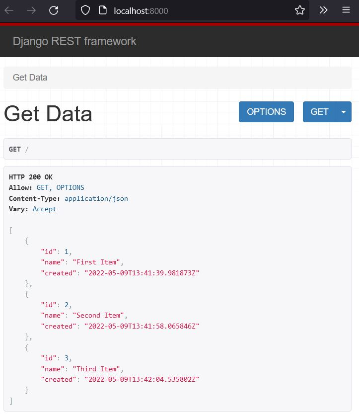
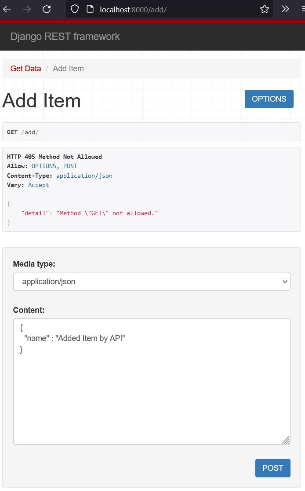
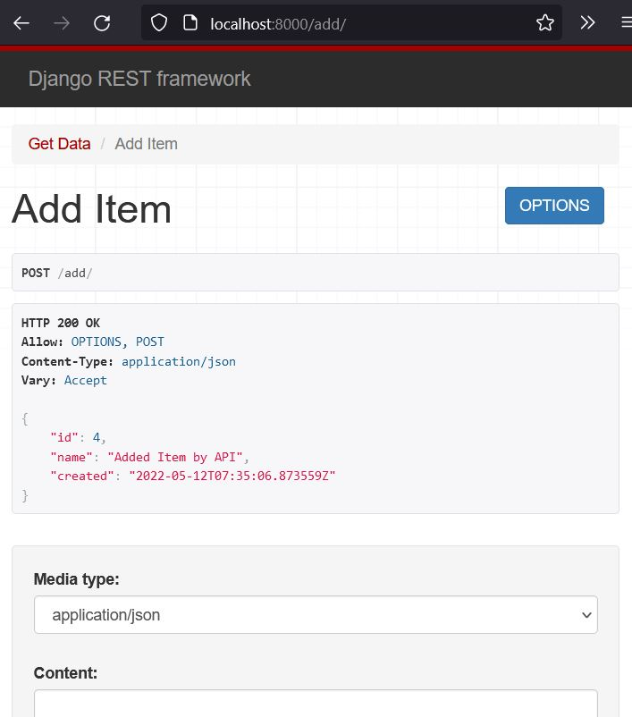

# A simple Django-Rest-Example

## run application
```shell
python3 manage.py runserver
```

## create db-modell 
```shell
python3 manage.py makemigrations
```

## apply schema to database
```shell
python3 manage.py migrate
```

## create requirements.txt
```shell
pip3 freeze > requirements.txt
```

## add data via shell
```shell
python3 manage.py shell

>>> from base.models import Item
>>> Item.objects.create(name="Item #1")
```

## build image locally
```shell
sudo docker build -t django .
```

## run container locally
```shell
docker container run -d -p 5000:5000 django:latest
```
[Open in Browser](http://localhost:5000)

## clean up old containers
```shell
docker rm $(docker ps -a -q)
```

## GET


## /add


## /add after post

